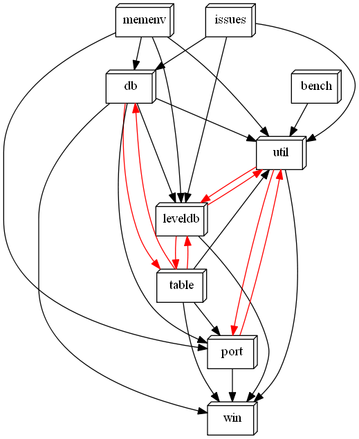

# Cpp Dependency Graph

<!-- [![Gem Version] -->

     

Generates useful dependency graphs to study the architecture of a C/C++ codebase.

Why do all the other languages have awesome tools to analyse codebases but C/C++ codebases do not?

It's time to change that.

This tool aims to -

- provide multiple views into the architecture of a codebase
- generate views at multiple levels of the architecture

This tool is inspired by [rubrowser](http://www.emadelsaid.com/rubrowser/) and [cpp-dependencies](https://github.com/tomtom-international/cpp-dependencies).

## Usage

### Installation

`gem install cpp_dependency_graph`

### Overall component dependency graph

To generate the overall component depenency graph for a project, use it like so -

`cpp_dependency_graph generate_graph -r spec\test\example_project\ -o deps.dot`

Below is the overall componet dependency graph for [leveldb](https://github.com/google/leveldb)

**NOTE** - If your project has a large number of components (> 100 and lots of connections between them), then generation (and subsequent rendering) may take some time.

### Individual component dependency graph

This will highlight the dependencies coming in and going out of a specific component. This allows you to filter out extraneous detail and study individual components in more detail.

`cpp_dependency_graph generate_graph -r spec\test\example_project\ -c Engine -o deps.dot`

Here's a component graph generated for the `queue` component in [rethinkdb](https://github.com/rethinkdb/rethinkdb)

Here's a component graph generated for the `table` component in [rocksdb](https://github.com/facebook/rocksdb)

### Component include dependency graph

This will highlight dependencies of includes within a specific component

`cpp_dependency_graph generate_graph -r spec\test\example_project\ -c Engine --include -o deps.dot`

Here's a component include graph generated for the `queue` component in [rethinkdb](https://github.com/rethinkdb/rethinkdb)

## Development

`bundle exec cpp_dependency_graph -r <dir> -c <component_name> -o <output_file>`

## License

cpp_dependency_graph is available under the MIT license.

## Warranty

This software is provided "as is" and without any express or implied
warranties, including, without limitation, the implied warranties of
merchantability and fitness for a particular purpose.
